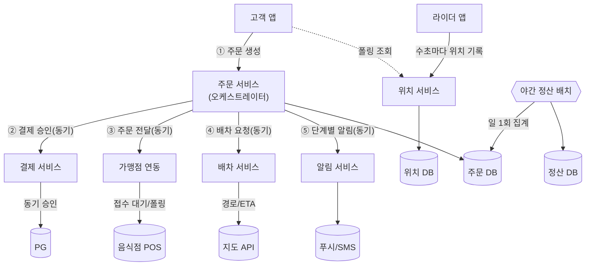
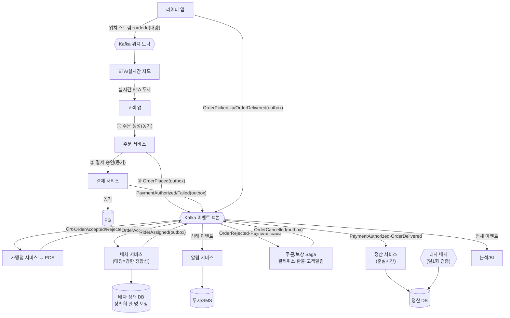

# F5 Kafka 사전 과제 제출

## 제출자

- 이름: Giwan Kim
- 깃허브 계정: [@giwankim](https://github.com/giwankim)

## 선택한 비즈니스 흐름

### 핵심 시나리오

- 음식 배달: **고객 주문 → 결제 → 음식점 접수 → 라이더 배차 → 실시간 추적 → 배달 완료 → 정산**.

### 이 흐름을 선택한 이유

- 한 흐름 안에 **이벤트로 분리하면 좋은 후속 처리(알림·정산·분석·추적)**와 **동기로 두어야 하는 정합성 핵심(결제 승인·라이더 배차)**이 공존한다.
- 그래서 "Kafka를 쓸 곳"과 "쓰지 말아야 할 곳"을 한 사례에서 모두 근거로 설명할 수 있다.

## 과제 1-1. 현재 구조 도식화

### 전체 흐름도

### 등장하는 사용자/시스템/외부 연동

- **사용자:** 고객, 음식점, 라이더, 운영자(CS)
- **내부 서비스:** 주문(중앙 오케스트레이터), 결제, 가맹점 연동, 배차, 위치, 알림, 정산
- **외부 연동:** PG(결제 승인/취소), 음식점 POS 태블릿, 지도 API, 푸시/SMS 제공자

### 요청과 데이터 흐름

- 주문 서비스가 모든 단계를 **동기 호출로 순차 오케스트레이션**: ① 주문 생성 → ② 결제 승인(PG) → ③ 음식점 접수(POS) → ④ 라이더 배차 → ⑤ 단계별 알림.
- **위치:** 라이더 앱이 수초마다 위치 DB에 기록, 고객 앱은 **폴링**으로 조회.
- **정산:** **야간 배치**로 일 1회 집계.

### 병목 또는 장애 포인트

- **B1 · 단일 결합점:** 주문 서비스가 ②~⑤를 동기로 대기 → 한 곳이 느리면 전체 지연, 장애 시 전 흐름 마비.
- **B2 · 외부 실패 역전파:** 푸시 장애로 알림(⑤)이 실패하면 주문 상태 갱신까지 막힘 — *알림 때문에 주문이 막히는 구조.*
- **B3 · 결제 재시도 중복:** PG 타임아웃 후 재시도 시 멱등성 없으면 중복 결제.
- **B4 · 위치 firehose + 폴링:** 수만 라이더 × 수초 쓰기 + 폴링 읽기 → 위치 DB 병목.
- **B5 · 배차 동시성:** 피크에 매칭 적체, race로 한 라이더가 두 주문에 이중 배정.
- **B6 · 야간 배치 정산:** 실패 시 정산 지연·재실행 부담, 실시간 가시성 없음.

### 현재 구조의 한계

- **L1 · 결합도:** 후속 처리(리워드·분석 등) 추가마다 주문 서비스 수정 → 변경 영향·배포 위험 큼.
- **L2 · 장애 격리 부재:** 비핵심(알림) 장애가 핵심(주문/결제)으로 전파.
- **L3 · 독립 확장 불가:** 후속 처리와 핵심 거래가 같은 경로·트랜잭션에 묶임.
- **L4 · 실시간성 부족:** 배치 정산 + 폴링 추적.

## 과제 1-2. EDA/Kafka 적용 검토

### 적용 여부

- **부분 적용.** 후속 처리(알림·정산·분석·위치 추적)는 Kafka 이벤트로 분리하고, **정합성 핵심(결제 승인·라이더 배차 결정)은 동기 유지**.
- **점진 전환(가역적):** P0 outbox(행동 변화 없음) → P1 위치 → P2 알림 → P3 정산(+대사 배치 유지) → P4 배차 → P5 오케스트레이터 축소. 통증이 큰 곳부터, 단계별 롤백 가능하게.

### 판단 근거

- **동기로 둘 것:** 호출자가 결과를 기다려야 함(결제 승인), 희소 자원을 정확히 한 번 배정(라이더).
- **이벤트로 뺄 것:** 호출자가 기다릴 필요 없는 후속 처리, 다수 소비자가 같은 사실에 반응(fan-out), 고처리량 텔레메트리(위치).
- 핵심 원칙: **"행위(결제·배정)는 동기로, 그 결과 '사실'만 이벤트로 발행."**

### 이벤트로 분리할 수 있는 흐름

- 알림 발송, 정산, 분석/BI, 음식점 주문 전달, 실시간 위치/ETA — 모두 호출자가 완료를 기다릴 필요가 없는 후속 처리.

### 이벤트 정의

- 과거형 사실로 정의(파티션 키: 주문 상태는 `orderId`, 위치는 `riderId`): `OrderPlaced`, `OrderAccepted`/`OrderRejected`, `RiderAssigned`, `OrderPickedUp`/`OrderDelivered`, `PaymentAuthorized`/`PaymentFailed`, `OrderCancelled`(보상 결과), `RiderLocationUpdated`.
- **위치 상관:** `RiderLocationUpdated`는 `riderId`로 파티셔닝하되 페이로드에 활성 `orderId`(들)를 포함 → ETA 소비자가 **스택 배차(한 라이더·여러 주문)**에서도 주문별로 위치를 매핑.
- **스키마:** **Schema Registry(Avro)** + 하위호환 버전 관리(필드 추가만 허용, 삭제·의미 변경 금지). 이벤트는 영구 API이므로 버전 규율을 강제한다.

### Producer

- 주문 서비스 `OrderPlaced` · 보상 Saga `OrderCancelled` · 결제 `PaymentAuthorized`/`PaymentFailed`(동기 결정 후 **사실**만 발행) · 가맹점 `OrderAccepted`/`OrderRejected` · 배차 `RiderAssigned` · 라이더 앱 `RiderLocationUpdated`/`OrderPickedUp`/`OrderDelivered`.

### Consumer

- 알림(상태 이벤트 — `OrderCancelled` 포함) · **보상 Saga(`OrderRejected`/`PaymentFailed` → 결제취소·환불·알림)** · 정산(`PaymentAuthorized`로 **승인 금액 확보** + `OrderDelivered`로 확정) · 분석/BI(전체) · 배차(`OrderAccepted`) · ETA·실시간 지도(`RiderLocationUpdated`).
- **컨슈머 그룹/스케일:** 소비자별 **독립 컨슈머 그룹**(알림·보상·정산·BI·배차·ETA)으로 격리하고, **파티션 수 ≥ 그룹 내 컨슈머 수**로 스케일 아웃. 위치 토픽은 파티션을 크게 잡아 firehose 처리량을 확보한다.

### 동기 호출보다 낫거나, 낫지 않다고 판단한 이유

- **나은 부분:** 결합도↓(주문 서비스는 발행만, 신규 소비자 추가 시 producer 무수정 → 단일 결합점 해소, L1/L3/B1), 장애 격리·**버퍼링(부하 평준화)**(알림·정산이 죽어도 이벤트가 쌓였다 복구, 주문은 안 막힘 → L2/B2), 위치 firehose 흡수(B4), 준실시간 정산 + 실시간 ETA로 실시간성 확보(B6/L4).
- **낫지 않은 부분:** 결제 승인은 즉시 성공/실패가 필요해 동기 유지(가상계좌 등 지연 결제만 비동기). 라이더 배차는 "정확히 한 명" 배정이라 강한 정합성 필요 — **Kafka는 로그이지 락·DB가 아니다.** 매칭 결정은 **배차 상태 DB**(정합성 저장소)에 두고 Kafka는 요청/결과만 운반(B5).
- **보상 트랜잭션(Saga):** 결제 성공 후 음식점 거부(`OrderRejected`)·배차 실패 시 **보상 Saga**가 결제 취소(환불) + 고객 알림으로 정합성을 복구 — 동기 핵심 경로의 실패를 이벤트로 안전하게 되돌린다.

### 운영 시 주의할 점

- **멱등성:** 재전달 대비 **고유 `eventId`** 기준 중복 제거·upsert(주문당 1회성 상태 이벤트는 `(orderId, eventType)`도 자연 키). 결제·정산은 **DB 유니크 제약**으로 중복 결제(B3)·중복 정산을 차단하고, 발행은 **outbox**로 이중 쓰기 방지.
- **순서 보장:** Kafka는 **파티션 내**에서만 보장(`enable.idempotence=true`로 producer 재시도 시 재정렬까지 차단) → 주문 상태는 `orderId`, 위치는 `riderId`로 파티셔닝. 토픽 간 순서는 보장 안 됨 → **인과관계 + 상태 머신 검증**으로 처리.
- **재처리:** 정산은 장기 retention 전제로 **오프셋 리셋 리플레이**. **알림은 재발송 금지**(전송 마커). **위치는 과거 전체 이력 리플레이가 무의미** → 이력은 **짧은 retention**으로 폐기하고, 최신 위치 상태만 필요하면 **compaction**으로 키별 최신값만 보존(상태 복원용).
- **장애 복구:** 오프셋부터 재개 + consumer lag 모니터링, poison 메시지는 **DLQ**(전용 소비자가 분류·재처리·알람), 브로커 장애는 outbox가 버퍼.
- **개인정보·위치정보:** `RiderLocationUpdated`는 위치정보법 대상 → **짧은 retention**·목적 외 보관 금지, 삭제권은 **키 삭제(compaction tombstone)**로 대응, 정산·BI에는 원위치 대신 **집계·마스킹** 결과만 전달.

## 과제 2. Event Driven Architecture 핵심 개념 정리

### Event Driven Architecture란 무엇인가?

- 서비스가 동기 호출 대신 **이벤트(일어난 사실)**를 브로커로 주고받는 구조. 생산자는 응답을 기다리지 않고(시간적 디커플링), 소비자가 누군지 모른다(참조적 디커플링).
- 예: 주문 서비스는 `OrderPlaced`만 발행하고, 알림·정산·분석의 존재를 모른다.

### 어떤 상황에서 특히 유리한가?

- 한 사실에 다수가 독립 반응(fan-out), 장애 격리·**버퍼링(부하 평준화)**, 고처리량 스트림, 리플레이/감사, 소비자 독립 확장·배포가 필요할 때.
- 이 흐름: 알림·정산·분석 fan-out + 위치 스트림 + 정산 리플레이가 모두 해당.

### 대표적인 단점이나 운영 비용은 무엇인가?

- 최종적 일관성(read-your-writes 깨짐), at-least-once → **멱등성 필수**, 이중 쓰기 방지용 **outbox 비용**, **관측성 붕괴**(한 주문이 여러 서비스로 흩어져 분산 추적 필수), 스키마 거버넌스(이벤트=영구 API), 운영 조직 비용.
- 잘못하면 결합을 없애는 게 아니라 **숨겨서** **분산 모놀리스**가 되어 오히려 더 나빠진다.

### Kafka는 EDA 안에서 어떤 역할을 하는가?

- **내구성 있고 리플레이 가능한 파티셔닝 로그**로서 이벤트 백본 역할: 고처리량 수집, 다수 독립 컨슈머 그룹이 같은 로그를 각자 속도로 소비, retention/replay, 파티션 내 순서.
- 즉 Kafka는 EDA의 **한 컴포넌트(전송·로그)**일 뿐, EDA 그 자체가 아니다.

### 내가 고른 비즈니스 흐름에서는 Kafka가 왜 필요하거나, 왜 아직 필요하지 않은가?

- **필요한 이유:** 독립 컨슈머 다수 + 위치 고처리량 스트림 + 리플레이/버퍼링 — 단순 큐보다 Kafka가 유리한 정확한 프로필이다.
- **아직 불필요할 수도:** 단일 리전·소비자 1개·저트래픽이라면 outbox + 단순 큐(SQS/RabbitMQ)가 더 단순·정확하다. **규모와 독립 소비자 수가 임계치를 넘을 때 도입(pressure-driven)** 하는 것이 맞다.

## 참고 자료

- Apache Kafka 공식 문서 — design, delivery semantics, log compaction, consumer groups
- Transactional Outbox 패턴 / CDC(Debezium) — dual-write 문제
- Saga 패턴(choreography vs orchestration)과 보상 트랜잭션
- CQRS / read model
- 개인정보보호법(삭제권·수집 최소화·보유기간), 위치정보법(라이더 위치)
