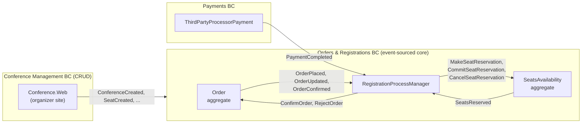
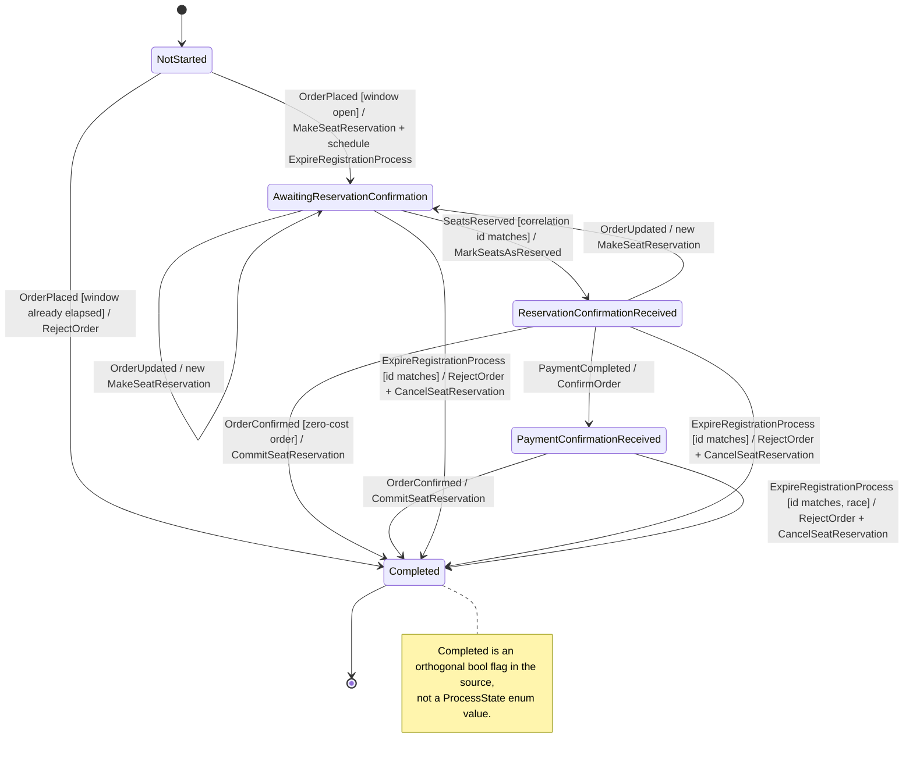

# Contoso 컨퍼런스 관리 시스템 — 이벤트와 등록 사가

> 마이크로소프트 **CQRS Journey** 샘플(2012, V3 코드)의 이벤트와 이벤트 처리 상태 머신을 정리한
> 학습 문서로, 아카이브된 소스 `microsoftarchive/cqrs-journey`를 기준으로 검증했다.
> 이 문서는 영문 원본 [English](./cqrs-journey-contoso.md)의 한국어 번역본이다.

## 1. 왜 이 시스템인가, 그리고 그 구조

Contoso는 컨퍼런스 좌석을 판매한다. 주최자가 컨퍼런스와 좌석 유형을 정의하고, 등록자가 주문을
넣으면 좌석이 일정 시간 동안 선점(hold)되며, (유료 주문이라면) 그 시간 안에 결제가 도착해야 주문이
살아남는다. 샘플은 이를 세 개의 바운디드 컨텍스트로 나눈다. **Orders & Registrations**가
이벤트 소싱된 핵심이고, 흥미로운 설계는 전부 여기에 있다. **Payments**는 외부 결제 프로세서를
감싼다. **Conference Management**는 의도적으로 평범한 CRUD 애플리케이션이다 — 시스템의 모든
부분이 이벤트 소싱의 복잡도를 감당할 가치가 있는 것은 아니기 때문이다.

컨텍스트끼리는 서로를 직접 호출하지 않는다. 경계를 넘는 것은 전부 버스 위의 메시지다.
*이벤트*는 일어난 일을 알리고, *커맨드*는 다음에 일어나야 할 일을 요청한다. 핵심 컨텍스트 내부의
애그리거트 사이에서도 같은 규율이 유지되는데, 바로 그 때문에 조정자(coordinator)가 필요해진다.
이것이 DDIA 3장이 설명하는 구조다: 상태 변화를 추가 전용(append-only) 이벤트 스트림으로 기록하고,
그 스트림으로부터 분리된 쓰기 모델과 읽기 모델을 만든다.

## 2. RegistrationProcessManager 상태 머신

*프로세스 매니저*는 서로 독립적인 애그리거트들을 하나의 비즈니스 플로우로 엮는 컴포넌트다. 자체
비즈니스 규칙은 갖지 않는다. 이벤트에 반응하고, 플로우가 어디까지 왔는지에 대한 약간의 상태를
유지하고, 다음 커맨드를 내보낼 뿐이다. 전체 스토리를 아는 유일한 컴포넌트이기도 하다 — `Order`
애그리거트는 좌석이 예약된다는 사실을 모르고, `SeatsAvailability`는 왜 예약하는지 모른다.
주목할 점: Journey 팀은 프로세스 매니저 자체를 이벤트 소싱하지 **않았다**. Entity Framework가
관리하는 SQL 한 행이며, 낙관적 동시성 제어용 `[ConcurrencyCheck]` 타임스탬프 컬럼으로 보호된다.

### 전이 표

| # | 트리거 (출처) | 가드 | 상태 → 상태 | 발행 커맨드 |
|---|---|---|---|---|
| 1 | `OrderPlaced` (Order 애그리거트) | `NotStarted` ∧ 만료 윈도우 > 0 | `NotStarted → AwaitingReservationConfirmation` | `MakeSeatReservation` (TTL = 윈도우 + 1분); `ExpireRegistrationProcess` (지연 = 윈도우 + 14분) |
| 2 | `OrderPlaced` | `NotStarted` ∧ 윈도우 ≤ 0 | `NotStarted →` **Completed** | `RejectOrder` |
| 3 | `OrderUpdated` (Order 애그리거트) | 상태 ∈ {`AwaitingReservationConfirmation`, `ReservationConfirmationReceived`} | → `AwaitingReservationConfirmation` | 새 `MakeSeatReservation` (새 커맨드 ID) |
| 4 | `SeatsReserved` (SeatsAvailability 애그리거트) | `AwaitingReservationConfirmation` ∧ 봉투 상관관계 ID == `SeatReservationCommandId` (불일치 ⇒ 조용히 스킵) | → `ReservationConfirmationReceived` | `MarkSeatsAsReserved` (만료 시각 포함) |
| 5 | `SeatsReserved` | 그 외 상태 ∧ 상관관계 ID 일치 | no-op (멱등한 재전달 스킵) | — |
| 6 | `PaymentCompleted` (Payments BC) | `ReservationConfirmationReceived` | → `PaymentConfirmationReceived` | `ConfirmOrder` |
| 7 | `OrderConfirmed` (Order 애그리거트) | 상태 ∈ {`ReservationConfirmationReceived`, `PaymentConfirmationReceived`} | → **Completed** (만료 취소) | `CommitSeatReservation` |
| 8 | `ExpireRegistrationProcess` (자기 자신에게 예약한 커맨드) | 커맨드 ID == `ExpirationCommandId` | → **Completed** | `RejectOrder`; `CancelSeatReservation` (소스의 TODO: 결제 취소) |
| 9 | `ExpireRegistrationProcess` | 커맨드 ID가 낡음(stale) | 무시 | — |

위에 없는 상태에서 이벤트가 도착하면 `InvalidOperationException`을 던진다(→ 인프라 재시도 /
데드레터). 7행에 허용 상태가 두 개인 이유: **무료 주문**은 `PaymentCompleted`를 한 번도 보지
않고 확정되기 때문이다.

### 하드닝 디테일

**상관관계 ID 필터링.** `SeatsReserved` 이벤트는 봉투의 상관관계 ID가, 프로세스 매니저가 가장
최근 `MakeSeatReservation`을 보낼 때 저장해 둔 `SeatReservationCommandId`와 일치할 때만
수용된다. 등록자가 주문을 수정하면 새 예약 커맨드가 이전 것을 대체하는데 — *이전* 커맨드에 대한
응답이 뒤늦게 도착할 수 있다. 낡은 응답은 ID 검사에 걸려 조용히 스킵되고, 이것이 재정렬과 중복
전달 아래에서도 프로세스 매니저가 올바르게 동작하는 방법이다.

**두 상태에서 수용되는 `OrderConfirmed`.** 무료 주문(100% 프로모 코드)은 `PaymentCompleted`
이벤트를 만들지 않는다. 확정이 직접 트리거된다. 그래서 프로세스 매니저는 `OrderConfirmed`를
`ReservationConfirmationReceived`와 `PaymentConfirmationReceived` 두 상태 모두에서 수용한다 —
플로우의 마지막 직전 단계가 하나가 아니라 둘인 것이다.

**만료는 상태가 아니라 지연된 커맨드다.** 주문이 들어오면 `Order` 애그리거트가 15분짜리 예약
윈도우를 찍는다(`Order.cs:38`). 프로세스 매니저는 `ExpireRegistrationProcess`를 자기 자신에게
예약하되 윈도우에 **14분의 버퍼를 더해** 지연시키고(`RegistrationProcessManager.cs:43`) — 즉
`OrderPlaced` 약 29분 후에 발화한다 — `MakeSeatReservation`에는 윈도우 + 1분의 TTL을 걸어
가망 없이 늦은 예약 커맨드는 그냥 증발하게 만든다. 그 사이 프로세스가 완료됐다면 만료 커맨드의
ID는 더 이상 `ExpirationCommandId`와 일치하지 않으므로 무시된다. 실제 레이스는 하나 남는다:
이 ID는 `OrderConfirmed`가 도착할 때에야 비워지므로, 윈도우 맨 끝에 아슬아슬하게 들어온 결제는
여전히 만료에게 질 수 있다 — 14분 버퍼는 그 가능성을 사실상 무의미하게 만들 뿐, 불가능하게
만들지는 않는다.

## 3. 조율되는 두 애그리거트

**`Order`**(이벤트 소싱)는 등록자 쪽 이야기다: 무엇을 요청했고, 얼마이고, 살아남았는가. 주문
라이프사이클 이벤트 — `OrderPlaced`, `OrderUpdated`, `OrderTotalsCalculated`,
`OrderPartiallyReserved`, `OrderReservationCompleted`, `OrderExpired`, `OrderConfirmed` — 를
발행하고, `RegisterToConference`, `MarkSeatsAsReserved`, `ConfirmOrder`, `RejectOrder` 커맨드로
구동된다. 관점의 분리에 주목하자: 예약이 성공했다고 *판단*하는 것은 프로세스 매니저지만,
`MarkSeatsAsReserved`로 통보받아 자신에 대한 `OrderReservationCompleted`를 *기록*하는 것은
주문이다.

**`SeatsAvailability`**(이벤트 소싱, 컨퍼런스당 한 인스턴스)는 재고 원장이다. 좌석 유형별로
몇 자리가 남았는가라는 단 하나의 질문에 답하며, `MakeSeatReservation`, `CommitSeatReservation`,
`CancelSeatReservation`, `AddSeats`, `RemoveSeats`에 반응해 `SeatsReserved`,
`SeatsReservationCommitted`, `SeatsReservationCancelled`, `AvailableSeatsChanged`를 발행한다.
경합이 몰리는 애그리거트다: 한 컨퍼런스의 모든 주문이 같은 인스턴스를 통과하며, 예약이 단순
차감이 아니라 선점(hold)/확정(commit) 2단계인 이유가 바로 이것이다.

두 애그리거트는 서로를 참조하지 않는다. `Order`는 재고를 건드리지 않고, `SeatsAvailability`는
등록자를 모른다. 각자 원자적으로 로드·변경·저장할 수 있는 작은 일관성 경계로 남는다 — 그리고
그 격리의 대가가 `RegistrationProcessManager`다: 플로우 로직이 제3의 장소에서, 자체 영속성과
자체 실패 모드를 갖고 살아야 한다. 팀 스스로도 이 선을 제대로 그었는지 확신하지 못했다.
프로세스 매니저의 상태 프로퍼티 한가운데에 이런 주석이 남아 있다
(`RegistrationProcessManager.cs:67-68`):

> "feels awkward and possibly disrupting to store these properties here. Would it be better if
> instead of using current state values, we use event sourcing?"
>
> (여기 이 프로퍼티들을 저장하는 게 어색하고 어쩌면 흐름을 해치는 것 같다. 현재 상태 값 대신
> 이벤트 소싱을 쓰는 편이 낫지 않았을까?)

## 4. 이벤트·커맨드 카탈로그

여기서 중요한 계약은 두 종류다. **퍼블릭 계약**(`Registration.Contracts`, `Payments.Contracts`,
`Conference.Contracts`)은 바운디드 컨텍스트 경계를 넘으므로 신중하게 버전 관리된다.
**BC 내부 이벤트**(`Registration/Events`)는 Orders & Registrations 컨텍스트를 벗어나지 않으므로
누구와도 조율 없이 자유롭게 바꿀 수 있다.

### 4.1 Order 애그리거트 이벤트 (퍼블릭, `Registration.Contracts/Events`)

| 이름 | 발행 / 처리 | 비고 |
|---|---|---|
| `OrderPlaced` | Order / PM, 읽기 모델 | 사가 시작; 좌석 목록 + `ReservationAutoExpiration` 포함 |
| `OrderUpdated` | Order / PM, 읽기 모델 | 등록자가 좌석 수정; PM이 재예약 |
| `OrderPartiallyReserved` | Order / 읽기 모델 | 요청 좌석 중 일부만 선점됨 |
| `OrderReservationCompleted` | Order / 읽기 모델 | 요청 좌석 전부 선점됨 |
| `OrderExpired` | Order / 읽기 모델 | 선점 만료 후 주문 거부됨 |
| `OrderConfirmed` | Order / PM, SeatAssignments 핸들러, 읽기 모델 | 최종 성공; 좌석 배정 생성도 트리거 |
| `OrderPaymentConfirmed` | — (폐기됨) / 마이그레이션 핸들러 | `OrderConfirmed`로 대체; 과거 저장 이벤트의 역직렬화를 위해 유지 |
| `OrderRegistrantAssigned` | Order / 읽기 모델 | 등록자 연락처 첨부 |
| `OrderTotalsCalculated` | Order / 읽기 모델 | 서버 측 가격 계산 완료 |

`OrderPaymentConfirmed` 행은 이 샘플의 이벤트 버저닝 잔혹사를 한 줄로 요약한다: 퍼블릭 이벤트의
이름 변경은 코드에서는 쉽지만 직렬화된 히스토리가 가득한 저장소에서는 감당 불가능하다 — 그래서
옛 타입은 남고, 읽을 때 번역된다.

### 4.2 SeatAssignments 애그리거트 이벤트 (퍼블릭, `Registration.Contracts/Events`)

| 이름 | 발행 / 처리 | 비고 |
|---|---|---|
| `SeatAssignmentsCreated` | SeatAssignments / 읽기 모델 | 확정된 주문으로부터 생성 |
| `SeatAssigned` | SeatAssignments / 읽기 모델 | 좌석에 참석자 배정 |
| `SeatUnassigned` | SeatAssignments / 읽기 모델 | 참석자 배정 해제 |
| `SeatAssignmentUpdated` | SeatAssignments / 읽기 모델 | 참석자 정보 변경 |

### 4.3 SeatsAvailability 이벤트 (BC 내부, `Registration/Events`)

| 이름 | 발행 / 처리 | 비고 |
|---|---|---|
| `SeatsReserved` | SeatsAvailability / PM, 읽기 모델 | 선점; 실제 선점 수량 포함(요청 수량과 다를 수 있음) |
| `SeatsReservationCommitted` | SeatsAvailability / 읽기 모델 | 선점을 영구 확정 |
| `SeatsReservationCancelled` | SeatsAvailability / 읽기 모델 | 선점분을 재고로 반환 |
| `AvailableSeatsChanged` | SeatsAvailability / 읽기 모델 | 프로젝션용 재고 증감 |

### 4.4 Registration 커맨드 (`Registration/Commands`)

| 이름 | 발신 → 처리 | 비고 |
|---|---|---|
| `RegisterToConference` | 공개 사이트 → Order | 주문 생성 |
| `AssignRegistrantDetails` | 공개 사이트 → Order | 연락처 정보 |
| `MakeSeatReservation` | PM → SeatsAvailability | TTL = 윈도우 + 1분으로 전송 |
| `MarkSeatsAsReserved` | PM → Order | 선점 성공을 주문에 통보 |
| `CommitSeatReservation` | PM → SeatsAvailability | 확정 시 |
| `CancelSeatReservation` | PM → SeatsAvailability | 만료 시 |
| `ConfirmOrder` | PM(결제 후) 또는 공개 사이트(무료 주문) → Order | 발신자는 둘, 의미는 하나 |
| `RejectOrder` | PM → Order | 만료 또는 도착 즉시 사망한 주문 |
| `ExpireRegistrationProcess` | PM → 자기 자신 | 29분 지연; 낡았으면 무시 |
| `AssignSeat` / `UnassignSeat` | 공개 사이트 → SeatAssignments | 구매 후 참석자 관리 |
| `AddSeats` / `RemoveSeats` | Conference Mgmt 연동 → SeatsAvailability | 주최자가 좌석 쿼터 변경 |

### 4.5 Payments BC (`Payments.Contracts`)

| 이름 | 종류 | 비고 |
|---|---|---|
| `PaymentInitiated` | 이벤트 | 등록자를 외부 결제 프로세서로 보냄 |
| `PaymentCompleted` | 이벤트 | PM이 구독하는 바로 그 이벤트 |
| `PaymentRejected` | 이벤트 | 프로세서 거절; 주문은 만료되도록 방치 |
| `PaymentAccepted` | 이벤트 | 샘플의 메인 플로우에서 **정의만 되고 발행되지 않음** |
| `InitiateThirdPartyProcessorPayment` | 커맨드 | 공개 사이트 → Payments |
| `CompleteThirdPartyProcessorPayment` | 커맨드 | 리턴 URL 콜백 → Payments |
| `CancelThirdPartyProcessorPayment` | 커맨드 | 등록자가 결제 중단 |
| `InitiateInvoicePayment` | 커맨드 | 인보이스 경로; 계약에는 있으나 샘플 UI에서는 미사용 |

### 4.6 Conference Management 연동 이벤트 (`Conference.Contracts`)

| 이름 | 발행 / 처리 | 비고 |
|---|---|---|
| `ConferenceCreated` | Conference Mgmt / Registration 읽기 모델 | CRUD 쪽이 저장 후 발행 |
| `ConferenceUpdated` | Conference Mgmt / Registration 읽기 모델 | |
| `ConferencePublished` | Conference Mgmt / Registration 읽기 모델 | 공개 사이트에 컨퍼런스 노출 |
| `ConferenceUnpublished` | Conference Mgmt / Registration 읽기 모델 | |
| `SeatCreated` | Conference Mgmt / SeatsAvailability 핸들러, 읽기 모델 | 재고 쪽에서 `AddSeats`가 됨 |
| `SeatUpdated` | Conference Mgmt / SeatsAvailability 핸들러, 읽기 모델 | 쿼터/가격 변경이 재고로 흘러감 |

## 5. 카프카 위에서 돌린다면

원본은 Azure Service Bus(토픽/구독) 위에서 돌고, 프로세스 매니저 상태와 이벤트 스토어는 SQL이다.
카프카로 옮기는 일은 대부분 직진이다 — 그리고 직진이 *아닌* 지점들이 바로 배울 거리다.

### 토픽과 키

| 토픽 | 키 | 근거 |
|---|---|---|
| `registration.order-events` | `OrderId` | 한 주문의 라이프사이클 이벤트가 한 파티션에서 순서 유지 |
| `registration.seats-availability-events` | `ConferenceId` | 좌석 재고는 컨퍼런스 단위의 경합 상태; 컨퍼런스별 단일 쓰기 순서 |
| `payments.events` | 결제 `SourceId` (페이로드에 상관관계용 `OrderId` 포함) | Payments BC는 자기 키 공간을 소유; PM은 `OrderId` 필드로 상관관계 매칭 |
| `conference.integration-events` | `ConferenceId` | CRUD 쪽 변경을 Registration 읽기 모델로 프로젝션 |

모든 행을 관통하는 원칙: **상태 머신이 순서대로 관찰해야 하는 이벤트들이 한 파티션에 떨어지도록
키를 골라라** — 카프카는 파티션 안에서만 순서를 보장하고, 토픽을 가로질러서는 절대 보장하지 않는다.

### 컨슈머로서의 프로세스 매니저

프로세스 매니저는 주문·좌석 재고·결제 토픽을 구독하는 하나의 컨슈머 그룹 서비스가 되고, 상태
행은 상관관계 ID(여기서는 `OrderId`)로 키를 잡은 데이터베이스에 둔다. 카프카가 절대 주지 *않는*
것은 이 세 토픽을 가로지르는 순서다: `PaymentCompleted`가 논리적으로 선행하는 `SeatsReserved`보다
먼저 소비될 수 있다. 그런데 전이 표를 다시 보라 — 출하된 프로세스 매니저는 이미 이걸 버틴다.
상관관계 ID 필터가 낡은 응답을 버리고, 5행이 재전달을 no-op으로 만들고, 7행이 `OrderConfirmed`를
두 상태에서 수용하고, 9행이 낡은 만료를 그냥 넘긴다. Journey의 하드닝 챕터는 사실상 카프카
컨슈머라면 어차피 해야 할 일의 체크리스트다.

### 지연 커맨드 공백

Service Bus는 예약 전송(`ExpireRegistrationProcess`, 29분 지연)과 메시지별
TTL(`MakeSeatReservation`, 윈도우 + 1분)을 기본 제공한다. 카프카에는 둘 다 없다. 선택지:

1. **Kafka Streams 펑추에이터** — 만료 대기 목록을 상태 저장소에 두고 주기 실행. PM이 이미
   Streams 애플리케이션이라면 깔끔하지만, 타이머 하나 때문에 Streams 런타임 전체를 끌고 온다.
2. **지연 토픽 + 일시정지 컨슈머** — 헤드 메시지가 여물 때까지 파티션을 pause. 동작은 하지만
   리밸런스와 `max.poll.interval.ms`와 영원히 싸운다.
3. **외부 스케줄러 / DB 폴링** — `ReservationAutoExpiration < now()`를 주기적으로 조회.

권장: **DB 폴링**. 프로세스 매니저의 상태는 이미 `ReservationAutoExpiration`을 담은 DB 행에
살고 있다. 그 테이블을 폴링하는 것은 지루하고, 지키려는 상태와 같은 트랜잭션 안에 있으며, 출하된
설계가 실제로 의존하는 방식에 가장 가깝다. TTL 쪽도 같은 방식으로 번역된다: 행이 윈도우가 닫혔다고
말한 뒤에 도착한 예약 커맨드는 그냥 무시한다 — 가드가 전송 계층에서 핸들러 안으로 이동하는 것이다.

### 전달 보장

Journey의 입장은 at-least-once 전송 + 멱등 핸들러 + 수동 중복 제거다 — 상관관계 ID,
`ExpirationCommandId` 검사, EF 낙관적 동시성 제어. 카프카의 exactly-once 시맨틱스가 이 장치들을
무용지물로 만들어 주지 않는다: 트랜잭션이 커버하는 것은 **카프카 안의**
consume-process-produce뿐이다. 프로세스 매니저의 상태 쓰기는 카프카 트랜잭션 바깥의 SQL
`UPDATE`이므로, "DB 행 갱신 + 커맨드 발행" 쌍은 여전히 찢어질 수 있다. 결국 같은 두 도구가
그대로 넘어온다: 소비 쪽에는 핸들러 멱등성, 발행 쪽에는 [아웃박스 패턴](./outbox-pattern.md) —
커맨드를 상태 변경과 같은 DB 트랜잭션으로 아웃박스 테이블에 쓰고, 이후 카프카로 릴레이한다.
[전달 보장 정리](./reliability-and-at-most-once.md)도 함께 보라.

## 6. Journey 팀이 기록한 교훈

- **프로세스 매니저의 영속성 모델이 내내 마음에 걸렸다.** 그 의심은 소스에 커밋되어 있다(§3의
  주석). 현재 상태 행 방식의 영속성은 주변의 이벤트 소싱된 애그리거트들에 비해 플로우의 재처리와
  감사를 어렵게 만들었다.
- **퍼블릭 계약은 영원하다.** `OrderPaymentConfirmed` → `OrderConfirmed`는 이름 변경처럼
  보이지만, 이벤트 스토어에서는 마이그레이션이고, 번역 핸들러이고, 영영 지울 수 없는 타입이다.
- **최종 일관성은 UI로 샌다.** `RegisterToConference` 이후 공개 사이트는 주문이 읽기 모델에
  나타날 때까지 폴링한다 — "잠시만 기다려 주세요" 루프. 백엔드에서 산 비동기성의 값은 UX 어딘가에서
  반드시 치러진다.
- **하드닝이 일정을 삼켰다.** Journey 후반부 챕터는 거의 전부 중복 제거, 재시도, 멱등성, 메시지
  순서 방어다 — 도메인 로직이 아니라 인프라.

[음식 배달 과제](./assignment.md)에서 그은 선이 여기서도 그대로 나타난다. 거기서 결제는 동기
요청/응답으로 남았고, 여기서도 `InitiateThirdPartyProcessorPayment`는 프로세서로 나가는 동기
리다이렉트다 — *결과*(`PaymentCompleted`)만 이벤트로 시스템에 재진입한다. 좌석 선점, 확정, 만료,
프로젝션: 비동기 이벤트 기반. 돈이 움직이거나 경합 재고에 *지금* 답해야 하는 순간: 동기. 전혀
다른 두 도메인, 같은 판단.
