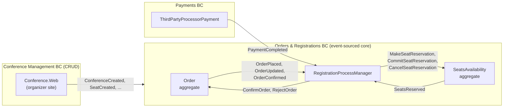
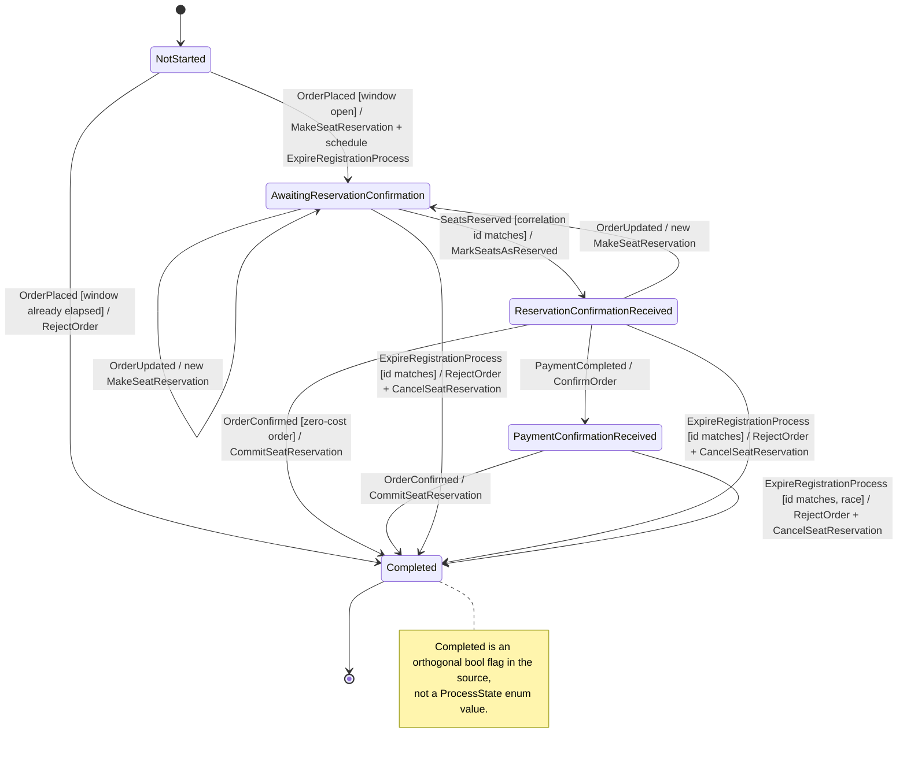

# Contoso Conference Management System — Events & the Registration Saga

> A study map of the events and the event-processing state machine in Microsoft's
> **CQRS Journey** sample (2012, V3 code), verified against the archived source at
> `microsoftarchive/cqrs-journey`. Korean version: [한국어](./cqrs-journey-contoso.ko.md)
>
> Why this system: *Designing Data-Intensive Applications* (2nd ed.), ch. 3
> ("Event Sourcing and CQRS") points at exactly this style of design; the CQRS Journey
> is the canonical worked example of it, warts and all.

## 1. Why this system, and its shape

Contoso sells conference seats: an organizer defines a conference and its seat types, a
registrant places an order, seats are held for a limited time, and the order only survives if
payment (when the order costs anything) arrives before the hold expires. The sample splits this
into three bounded contexts. **Orders & Registrations** is the event-sourced core, where the
interesting design lives. **Payments** wraps a third-party payment processor. **Conference
Management** is deliberately boring — a plain CRUD application — because not every part of a
system earns the complexity of event sourcing.

The contexts never call each other directly. Everything crossing a boundary is a message on a
bus: *events* announce what happened, *commands* request what should happen next. Inside the core
context the same discipline holds between aggregates, which is what makes a coordinator necessary
at all. This is the shape DDIA ch. 3 describes: state changes captured as an append-only stream of
events, with separated write and read models built from that stream.

## 2. The RegistrationProcessManager state machine

A *process manager* is the component that turns a set of independent aggregates into a business
flow. It owns no business rules of its own: it reacts to events, keeps a little state about where
the flow stands, and emits the next command. It is the only component that knows the whole story —
the `Order` aggregate does not know seats get reserved, and `SeatsAvailability` does not know why.
Notably, the Journey team did **not** event-source the process manager itself: it is a single SQL
row managed by Entity Framework, protected by an optimistic-concurrency `[ConcurrencyCheck]`
timestamp column.

### Transition table

| # | Trigger (source) | Guard | State → State | Commands emitted |
|---|---|---|---|---|
| 1 | `OrderPlaced` (Order agg.) | `NotStarted` ∧ expiration window > 0 | `NotStarted → AwaitingReservationConfirmation` | `MakeSeatReservation` (TTL = window + 1 min); `ExpireRegistrationProcess` (delay = window + 14 min) |
| 2 | `OrderPlaced` | `NotStarted` ∧ window ≤ 0 | `NotStarted →` **Completed** | `RejectOrder` |
| 3 | `OrderUpdated` (Order agg.) | state ∈ {`AwaitingReservationConfirmation`, `ReservationConfirmationReceived`} | → `AwaitingReservationConfirmation` | new `MakeSeatReservation` (new command ID) |
| 4 | `SeatsReserved` (SeatsAvailability agg.) | `AwaitingReservationConfirmation` ∧ envelope correlation ID == `SeatReservationCommandId` (mismatch ⇒ silently skip) | → `ReservationConfirmationReceived` | `MarkSeatsAsReserved` (carries expiration) |
| 5 | `SeatsReserved` | other state ∧ correlation matches | no-op (idempotent re-delivery skip) | — |
| 6 | `PaymentCompleted` (Payments BC) | `ReservationConfirmationReceived` | → `PaymentConfirmationReceived` | `ConfirmOrder` |
| 7 | `OrderConfirmed` (Order agg.) | state ∈ {`ReservationConfirmationReceived`, `PaymentConfirmationReceived`} | → **Completed** (expiration cancelled) | `CommitSeatReservation` |
| 8 | `ExpireRegistrationProcess` (self-scheduled cmd) | cmd ID == `ExpirationCommandId` | → **Completed** | `RejectOrder`; `CancelSeatReservation` (source TODO: cancel payment) |
| 9 | `ExpireRegistrationProcess` | cmd ID stale | ignored | — |

Any event arriving in a state not listed above throws `InvalidOperationException`
(→ infra retry / dead-letter). Row 7's two accepted states exist because a **zero-cost order**
confirms without ever seeing `PaymentCompleted`.

### Hardening subtleties

**Correlation filtering.** A `SeatsReserved` event is accepted only when its envelope correlation
ID equals the `SeatReservationCommandId` the process manager stored when it sent the latest
`MakeSeatReservation`. When a registrant edits their order, a new reservation command supersedes
the old one — and the response to the *old* command may still arrive. The stale response fails
the ID check and is silently skipped, which is how the PM stays correct under reordering and
duplicate delivery.

**Two-state `OrderConfirmed`.** A zero-cost order (100% promo code) never produces a
`PaymentCompleted` event; confirmation is triggered directly. So the PM accepts `OrderConfirmed`
from both `ReservationConfirmationReceived` and `PaymentConfirmationReceived` — the flow has two
legitimate last-but-one steps, not one.

**Expiration is a delayed command, not a state.** When the order is placed, the `Order` aggregate
stamps a 15-minute reservation window (`Order.cs:38`). The PM schedules
`ExpireRegistrationProcess` back to itself, delayed by the window **plus a 14-minute buffer**
(`RegistrationProcessManager.cs:43`) — so it fires ~29 minutes after `OrderPlaced` — and sends
`MakeSeatReservation` with a TTL of window + 1 minute so a hopelessly late reservation command
just evaporates. If the process completed meanwhile, the expire command's ID no longer matches
`ExpirationCommandId` and is ignored. One real race remains: the ID is only cleared when
`OrderConfirmed` arrives, so a payment squeezed in at the very end of the window can still lose
to the expiration — the 14-minute buffer exists to make that window practically irrelevant, not
impossible.

## 3. The two coordinated aggregates

**`Order`** (event-sourced) is the registrant's side of the story: what was requested, what it
costs, and whether it survived. It emits the order lifecycle events — `OrderPlaced`,
`OrderUpdated`, `OrderTotalsCalculated`, `OrderPartiallyReserved`, `OrderReservationCompleted`,
`OrderExpired`, `OrderConfirmed` — and is driven by the commands `RegisterToConference`,
`MarkSeatsAsReserved`, `ConfirmOrder`, and `RejectOrder`. Note the split of perspective: the
*process manager* decides that a reservation succeeded, but it is the *order* that records
`OrderReservationCompleted` about itself when told via `MarkSeatsAsReserved`.

**`SeatsAvailability`** (event-sourced, one instance per conference) is the inventory ledger. It
answers exactly one question — how many seats of each type remain — and emits `SeatsReserved`,
`SeatsReservationCommitted`, `SeatsReservationCancelled`, and `AvailableSeatsChanged` in response
to `MakeSeatReservation`, `CommitSeatReservation`, `CancelSeatReservation`, `AddSeats`, and
`RemoveSeats`. It is the contended aggregate: every order for a conference funnels through the
same instance, which is why reservation is a two-phase hold/commit rather than a single decrement.

Neither aggregate references the other. `Order` never touches inventory; `SeatsAvailability`
never sees registrants. Each remains a small consistency boundary that can be loaded, mutated,
and stored atomically — and the price of that isolation is the `RegistrationProcessManager`:
the flow logic has to live in a third place, with its own persistence and its own failure modes.
The team themselves were not sure they drew this line right; this comment sits in the middle of
the process manager's state properties (`RegistrationProcessManager.cs:67-68`):

> "feels awkward and possibly disrupting to store these properties here. Would it be better if
> instead of using current state values, we use event sourcing?"

## 4. Event & command catalog

Two kinds of contracts matter here. **Public contracts** (`Registration.Contracts`,
`Payments.Contracts`, `Conference.Contracts`) cross bounded-context boundaries and are versioned
carefully. **BC-internal events** (`Registration/Events`) never leave the Orders & Registrations
context, so they can change freely without coordinating with anyone.

### 4.1 Order aggregate events (public, `Registration.Contracts/Events`)

| Name | Emitted by / Handled by | Notes |
|---|---|---|
| `OrderPlaced` | Order / PM, read models | Starts the saga; carries seats + `ReservationAutoExpiration` |
| `OrderUpdated` | Order / PM, read models | Registrant edited seats; PM re-reserves |
| `OrderPartiallyReserved` | Order / read models | Only some requested seats could be held |
| `OrderReservationCompleted` | Order / read models | All requested seats held |
| `OrderExpired` | Order / read models | Order rejected after the hold lapsed |
| `OrderConfirmed` | Order / PM, SeatAssignments handler, read models | Terminal success; also triggers seat-assignment creation |
| `OrderPaymentConfirmed` | — (deprecated) / migration handler | Replaced by `OrderConfirmed`; kept for deserialization of old stored events |
| `OrderRegistrantAssigned` | Order / read models | Registrant contact details attached |
| `OrderTotalsCalculated` | Order / read models | Pricing computed server-side |

The `OrderPaymentConfirmed` row is the sample's event-versioning war story in one line: renaming a
public event is easy in code and unpayable in a store full of serialized history — so the old type
stays, translated on read.

### 4.2 SeatAssignments aggregate events (public, `Registration.Contracts/Events`)

| Name | Emitted by / Handled by | Notes |
|---|---|---|
| `SeatAssignmentsCreated` | SeatAssignments / read models | Created from a confirmed order |
| `SeatAssigned` | SeatAssignments / read models | Attendee attached to a seat |
| `SeatUnassigned` | SeatAssignments / read models | Attendee removed |
| `SeatAssignmentUpdated` | SeatAssignments / read models | Attendee details changed |

### 4.3 SeatsAvailability events (BC-internal, `Registration/Events`)

| Name | Emitted by / Handled by | Notes |
|---|---|---|
| `SeatsReserved` | SeatsAvailability / PM, read models | The hold; carries actual reserved counts (may differ from requested) |
| `SeatsReservationCommitted` | SeatsAvailability / read models | Hold made permanent |
| `SeatsReservationCancelled` | SeatsAvailability / read models | Hold released back to inventory |
| `AvailableSeatsChanged` | SeatsAvailability / read models | Inventory delta for projections |

### 4.4 Registration commands (`Registration/Commands`)

| Name | Sent by → Handled by | Notes |
|---|---|---|
| `RegisterToConference` | Public site → Order | Creates the order |
| `AssignRegistrantDetails` | Public site → Order | Contact details |
| `MakeSeatReservation` | PM → SeatsAvailability | Sent with TTL = window + 1 min |
| `MarkSeatsAsReserved` | PM → Order | Tells the order its hold succeeded |
| `CommitSeatReservation` | PM → SeatsAvailability | On confirmation |
| `CancelSeatReservation` | PM → SeatsAvailability | On expiration |
| `ConfirmOrder` | PM (after payment) or public site (zero-cost) → Order | Two senders, one meaning |
| `RejectOrder` | PM → Order | On expiration or dead-on-arrival orders |
| `ExpireRegistrationProcess` | PM → itself | Delayed 29 min; ignored if stale |
| `AssignSeat` / `UnassignSeat` | Public site → SeatAssignments | Post-purchase attendee management |
| `AddSeats` / `RemoveSeats` | Conference Mgmt integration → SeatsAvailability | Organizer changed seat quotas |

### 4.5 Payments BC (`Payments.Contracts`)

| Name | Kind | Notes |
|---|---|---|
| `PaymentInitiated` | event | Registrant sent to the third-party processor |
| `PaymentCompleted` | event | The one the PM subscribes to |
| `PaymentRejected` | event | Processor declined; order left to expire |
| `PaymentAccepted` | event | **Defined but never published** in the sample's main flow |
| `InitiateThirdPartyProcessorPayment` | command | Public site → Payments |
| `CompleteThirdPartyProcessorPayment` | command | Return-URL callback → Payments |
| `CancelThirdPartyProcessorPayment` | command | Registrant backed out |
| `InitiateInvoicePayment` | command | Invoice path; present in contracts, not exercised by the sample UI |

### 4.6 Conference Management integration events (`Conference.Contracts`)

| Name | Emitted by / Handled by | Notes |
|---|---|---|
| `ConferenceCreated` | Conference Mgmt / Registration read models | CRUD side publishes after saving |
| `ConferenceUpdated` | Conference Mgmt / Registration read models | |
| `ConferencePublished` | Conference Mgmt / Registration read models | Conference visible to the public site |
| `ConferenceUnpublished` | Conference Mgmt / Registration read models | |
| `SeatCreated` | Conference Mgmt / SeatsAvailability handler, read models | Becomes `AddSeats` on the inventory |
| `SeatUpdated` | Conference Mgmt / SeatsAvailability handler, read models | Quota/price changes flow into inventory |
