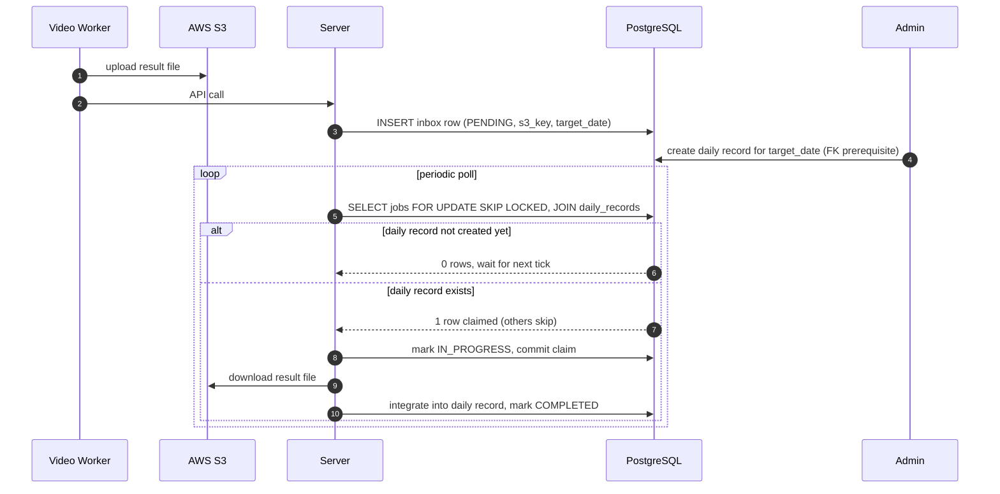

- 메시지 전송 보장 방식: exactly once / at least once / at most once
- 자신이 지금 하고 있는 서비스에서 해당 메시지 전송 보장 방식을 고민해 본 이야기들을 전달해 주세요.
- 지금 나의 로직이 해당 로직을 보장하고 있는지 구체적이고 실증적인 이야기들을 가져와 주시면 감사하겠습니다.

## 카프카 메시지 전송 보장 방식 이론

메시지 전송 보장 방식 관련 [Kafka: The Definitive Guide](https://www.confluent.io/resources/ebook/kafka-the-definitive-guide)의 7장을 다 읽고 현재 8장을 읽고 있습니다.

### 7장 Reliable Data Delivery

7장에서는 메시지 유실을 방지하는 at-least-once delivery를 보장하기 위한 브로커, 프로듀서, 컨슈머 설정을 다룹니다. 먼저 ACID처럼 카프카가 보장하는 네 가지 속성은 다음과 같습니다:

1. 하나의 partition 내에서의 순서 보장
2. 프로듀서가 전송한 메시지가 모든 ISR에 저장(disk에 flush X)되었을 때 커밋되었다고 한다. 단, 프로듀서는 ack를 네트워크에 전송한 시점, 리더에 쓰인 시점, 완전히 커밋된 시점에 받을 수 있다.
3. 하나의 레플리카가 살아있으면 커밋된 메시지가 유실되지 않는다.
4. 컨슈머는 커밋된 메시지만을 읽을 수 있다.

#### Replication

In-sync replica 대비 replication.factor의 뉘앙스 차이

#### Broker

- `(default.)replication.factor`
- `unclean.leader.election.enable`
- `min.insync.replicas`
- Linux page cache에서 메시지가 디스크에 flush되는 `fsync` 호출 주기

#### Producer

- `acks` 설정
- 에러 핸들링 설정 및 코드

#### Consumer

- `group.id`
- `auto.offset.reset`
- `enable.auto.commit`
- `auto.commit.interval.ms`

수동으로 offset을 커밋할 때 고려할 점들...

### 8장 Exactly-Once Semantics

#### Idempotent Producer

- PID + sequence number
- `max.in.flight.requests.per.connection <= 5`
- 한계: producer의 retry로 발생하는 중복만을 제거한다. 예를 들어 `producer.send()`를 두 번 호출하면 중복 메시지 생성.
- 사용법: `enable.idempotence=true`

#### Transactions

Stream processing에서 파생된 기능.

문제 상황:
- 애플리케이션이 죽어서 output은 생성되었는데 offset commit이 되기 전이다.
- 좀비 애플리케이션, 죽어있다가 뒤늦게 살아난다.

원리:
- atomic multipartition writes

## 메시지 전송이 사용되는 로직

영상 분석 플랫폼에서 결과를 S3에 파일로 업로드하면 서버에서 그 파일을 읽는 로직이 있습니다. 다만 파일을 저장하기에 앞서서 어드민에서 기록을 생성한 이후에만 결과값을 저장할 수 있다는 제약이 있어서 (어드민에서 생성한 기록이 fk) 메시지 큐 도입을 고려했습니다. 여러 개의 소스에서 싱크로 연동해야 하는 것도 아니고 단순히 하나의 시스템에서 다른 시스템으로 메시지를 전달하는 point-to-point 방식이기에 AWS SQS를 도입하고 싶었는데 ML 쪽에서 SQS에 메시지 전송을 못하겠다 🤯 하지만 API 호출은 해줄 수 있다고 해서 데이터베이스에 inbox 메시지 테이블을 만들고 서버에서 정기적으로 inbox 테이블을 polling하는 방식으로 구현했습니다. 데이터베이스는 PostgreSQL을 사용하고 있어서 `SKIP LOCKED`를 사용하여 at-most-once delivery를 보장했습니다. 이미 Redis를 사용하고 있어서 `ShedLock`도 고려해봤습니다.

실제로 작년 [스프링캠프 올리브영 발표](https://youtu.be/Tlh-8msdOM8?si=pvQPoo9jwUltGMv7&t=321)에서 카프카를 도입하기 전에 다양한 시스템들 간의 연동은 이렇게 inbox 테이블에 서로 메시지를 전달하고 배치 처리하는 방식이었다고 합니다. 이런 패턴들이 [Enterprise Application Integration Patterns](https://www.enterpriseintegrationpatterns.com)에 존재하고 있는 것이라는 생각이 듭니다. 왜냐하면 Spring Integration Jdbc를 사용해서 데이터베이스로 channel을 만드는 방식을 전에 이 [블로그 글](https://www.wimdeblauwe.com/blog/2024/06/25/transactional-outbox-pattern-with-spring-boot)에서 읽은 기억이 있기 때문입니다.

## 메시지 전송 보장 방식

사실 이 시스템에서는 at-least-once만 보장되면 됩니다. idempotency key나 transactional producer가 필요하지 않습니다. 데이터를 중복해서 읽는 비효율은 있겠지만 데이터의 정합성에는 문제가 없습니다. 하지만 `SKIP LOCKED`를 활용해서 at-most-once 보장을 했습니다. 그래서 exactly-once 보장을 헸습니다.

더 좋은 예시로는 PG 연동 관련 [Chain Services with Exactly Once Guarantees](https://www.confluent.io/blog/chain-services-exactly-guarantees)이 있는데 이것도 확습하려고 했는데, 다음주에 보겠습니다.
